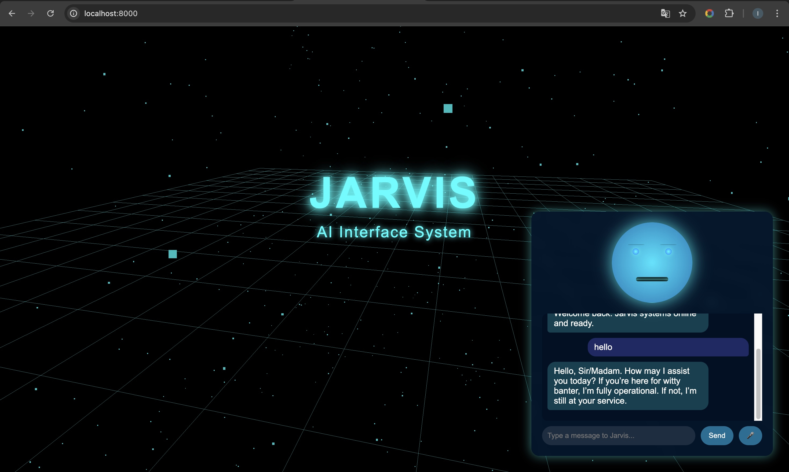

# JARVIS Holographic Interface

A 3D holographic interface inspired by Jarvis from Iron Man, built with Three.js and powered by AI through OpenRouter.



## Features

- 🤖 Interactive AI assistant with speech synthesis
- 🎙️ Voice recognition for hands-free interaction
- 🧠 Advanced AI intelligence using OpenRouter API
- 🌐 3D holographic environment with stunning visual effects
- 💬 Chat interface with conversation history
- 🔄 Fallback responses when offline

## Setup

### Prerequisites

- A modern web browser
- An [OpenRouter](https://openrouter.ai) account and API key

### Installation

1. Clone this repository:
   ```
   git clone https://github.com/yourusername/jarvis-holographic-interface.git
   cd jarvis-holographic-interface
   ```

2. Edit the `js/config.js` file and replace `YOUR_OPENROUTER_API_KEY` with your actual OpenRouter API key:
   ```javascript
   OPENROUTER_API_KEY: 'your-actual-api-key',
   ```

3. Start a local web server (one of the following):
   ```
   # Using Python 3
   python -m http.server 8000
   
   # Using Python 2
   python -m SimpleHTTPServer 8000
   
   # Using Node.js
   npx serve
   ```

4. Open your browser and navigate to `http://localhost:8000`

## Usage

1. When the page loads, Jarvis will automatically appear and greet you
2. Interact with Jarvis by:
   - Typing in the input box and pressing Enter or clicking Send
   - Clicking the microphone button and speaking
3. Jarvis will respond both with text and speech
4. Click the robot head to hide/show the chat interface

## Customization

### Changing the AI Model

Edit the `js/config.js` file to change the AI models used:

```javascript
// Default AI model to use
DEFAULT_MODEL: 'anthropic/claude-3-opus:beta',

// Fallback model if the default is unavailable
FALLBACK_MODEL: 'openai/gpt-4o',
```

Available models depend on your OpenRouter account. Check [OpenRouter Models](https://openrouter.ai/docs/models) for a complete list.

### Visual Customization

The 3D environment and visual effects can be customized in the `js/main.js` file under the `JarvisInterface` class.

The styling of the interface can be modified in the `css/style.css` file.

## Notes

- Speech recognition requires HTTPS for most browsers except on localhost
- The OpenRouter API key should be kept private and not shared
- Different AI models may have different costs associated with them

## License

MIT 